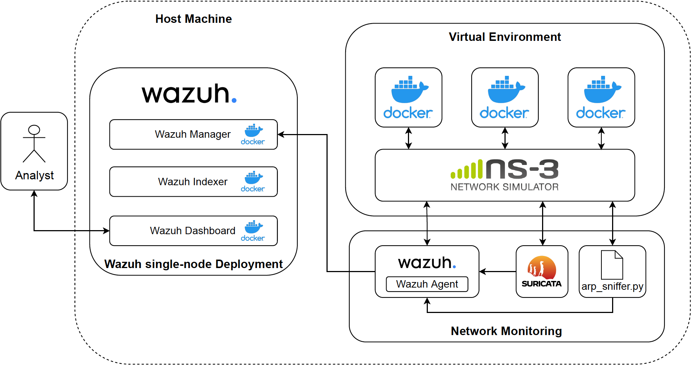

# Detection of simulated Cyber Attacks against an IIoT Network using a SIEM System

## Description

SIEM systems are already in use as part of the Security Operations Center (SOC) within the organizations overall security strategy. They offer comprehensive security analyses and enable SIEM analysts to secure the network more efficiently. In the context of the IIoT, cyber-attacks are becoming more complex and using more points of attack, which is why a holistic view of enterprise security is crucial [[VGD+21](https://link.springer.com/chapter/10.1007/978-3-030-81242-3_17)].

Applying SIEM to IIoT applications poses a promising approach to enhance cyber security. This work proposes a prototypical implementation of an IIoT network simulator and demonstrates the application of SIEM systems in the IIoT. To demonstrate the convenience of the SIEM, three use cases are implemented. The use cases represent various cyber attacks on the simulated network. Based on the attacks, it is shown how a SIEM system can be adapted to the IIoT to detect cyber attacks. In the long term, an IIoT network can thus be incorporated into the enterprise-wide security infrastructure. 


## Architecture

The architecture of the protoype consists of three main building blocks:
- The **Virtual Environment** represents the simulation environment of the prototype. Here, the IIoT network is simulated and the attacks are executed. For the virtual network [ns-3](https://www.nsnam.org/) is used. The IIoT devices are implemented through Docker containers.
- The **Network Monitoring** module monitors the virtual environments and informs the SIEM about alerts. 
- The **SIEM** system is realized with the open source security platform [Wazuh](https://wazuh.com/)



## Installation (on Ubuntu 20.04 LTS)

#### 1. Install [Docker](https://docs.docker.com/engine/install/ubuntu/) (version 20.10.17, build 100c701) and [Docker-Compose](https://docs.docker.com/compose/install/) (version v2.6.0) as described in the respective docs

#### 2. Clone the repository:
```bash
git clone https://github.com/philippschwa/MA.git
```
If you have cloned the repo, you can ether use the setup_project.sh script to install the projects dependencies and skip to step 6 or you can install everything manually according to step 3 - 5.

#### 3. Install the depenencies:
Run as sudo:
```bash
apt-get update -y && apt-get upgrade -y
apt install -y g++ python3 python3-pip cmake python3-setuptools git \
  tcpdump uml-utilities bridge-utils jq iproute2 net-tools
```

#### 4. Install and build ns3 (version 3.36)
First we need to install the dependencies (1), then we install ns3 and build the ns3 project (2). For further information and other installation methods, see also the installation guide of [ns3](https://www.nsnam.org/wiki/Installation). But notice that there is no warranty that my project it will work with other intallation methods (e.g. the installtion with bake did not work for me), furthermore we are only installing minimum mandatory packages for ns3.

Clone ns3 project:
```bash 
git clone https://gitlab.com/nsnam/ns-3-allinone.git 
```
Change to the ns-3-allinone directory, download ns3 version 3.36 and build the ns3 project. Do NOT run download.py and build.py as sudo (using sudo will end in an error):
```bash
cd ns-3-allinone 
./download.py -n ns-3.36 
./build.py
```

Copy custom ns3 files and build virtual network
```bash
cp ns3_docker/ns3/ns3 ns-3-allinone/ns-3.36/ns3
cp ns3_docker/ns3/sim_topo.cc ns-3-allinone/ns-3.36/scratch/sim_topo.cc
./ns-3-allinone/ns-3.36/ns3 build scratch/sim_topo.cc
``` 

#### 5. Install Suricata and Wazuh agent
Install Wazuh Agent (see also [Wazuh's](https://documentation.wazuh.com/current/installation-guide/wazuh-agent/wazuh-agent-package-linux.html) official documentation)
```bash
curl -s https://packages.wazuh.com/key/GPG-KEY-WAZUH | apt-key add - 
echo "deb https://packages.wazuh.com/4.x/apt/ stable main" | tee -a /etc/apt/sources.list.d/wazuh.list 
apt-get update 
WAZUh_MANAGER="123.123.0.2" apt-get install -y wazuh-agent
echo "wazuh-agent hold" | dpkg --set-selections
```
Install Suricata (see also [Suricata's](https://suricata.readthedocs.io/en/suricata-6.0.0/install.html) official documentation)
```bash
apt install -y software-properties-common 
apt-get update
add-apt-repository ppa:oisf/suricata-stable 
apt-get update && apt-get install -y suricata 
```
Copy custom config files
```bash
cp network_monitoring/suricata/suricata.yaml /etc/suricata/suricata.yaml
cp network_monitoring/suricata/rules/local.rules /etc/suricata/rules/local.rules
cp network_monitoring/wazuh_agent/ossec.conf /var/ossec/etc/ossec.conf
cp network_monitoring/wazuh_agent/close_ssh.sh /var/ossec/active-response/bin/close_ssh.sh
```
Enable Wazuh and Suricata service
```bash
systemctl daemon-reload
systemctl enable suricata
systemctl enable wazuh-agent
systemctl start wazuh-agent
```

#### 6. Enjoy. All dependencies are installed. The simulation prototype is ready to use. 

## Usage

#### 1. Start the wazuh-single-node deployment
Run the following command from the wazuh-single-node folder to start the Wazuh Manager, Indexer and Dashboard.  
```bash
docker compose up
```
#### 2. Setup and start the virtual network and the simulation 
Run the following command from the ns3_docker folder:
```bash
sudo pyhton3 main.py setup
```

#### 3. Start the network monitoring module
If you used the setup_project.sh script the wazuh agent should be configured and running. You can check the status of the agent with:
```bash
sudo service wazuh-agent status
```
To start Suricata for network monitoring, execute:
```bash
sudo suricata -i br-plc
```
The ARP Spoof detection can be started with:
```bash
sudo python3 arp_sniffer.py
```

#### 4. Use
After everything is up and running, the prototype is fully functional. The Cyber-attacks can be launched from the attacker container. To connect to any container use:
```bash
docker exec -it <container-name> bash
```

The Wazuh dashboard can be accessed from a Web Browser. You need to add the certificate in order to access the dashboard. The address is:
```bash
https://192.168.2.173:443
User: admin
Pw: SecretPassword
```
