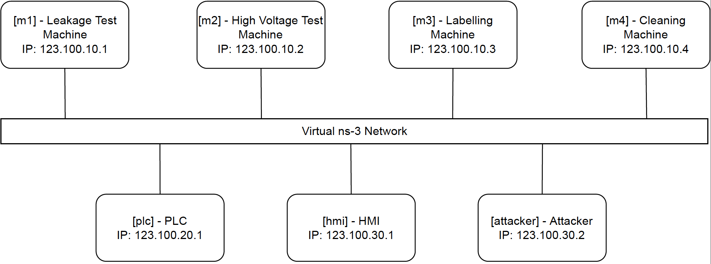

## Virtual Network Simulation: The end-of-line process

The following describes the virtual network simulation of the developed prototype. The simulation component represents a industrial end-of-line process, consisting of four machines, one PLC and and HMI that are connected by an ethernet network. 

The underlying end-of-line process is simulated as follows. The M2M communication is implemented using python scripts. Once the simulation is started, the python scripts are automatically executed on each of the four machines and the PLC. On start up, each script sets up a python network socket, listening on port 5005 for incoming connections. The machine scripts all listen for incoming connections and execute their process if they get the "can_produce=True" message from the PLC. To simulate the machine processes, the duration was set to 20 seconds, and it was assumed that the process could either succeed (98%) or fail (2%). Depending on the result, the PLC is informed with the message "set\_result=True" or "set\_result=False". The PLC script, listens for incoming connections from the machines, processes the received message, and depending on the message either informs the corresponding next machine or discards the component and restarts the process. Once an electrical spring has passed through the entire process, the last machine informs the PLC to be finished and the process starts again from the beginning with the PLC notifying the first machine. 
